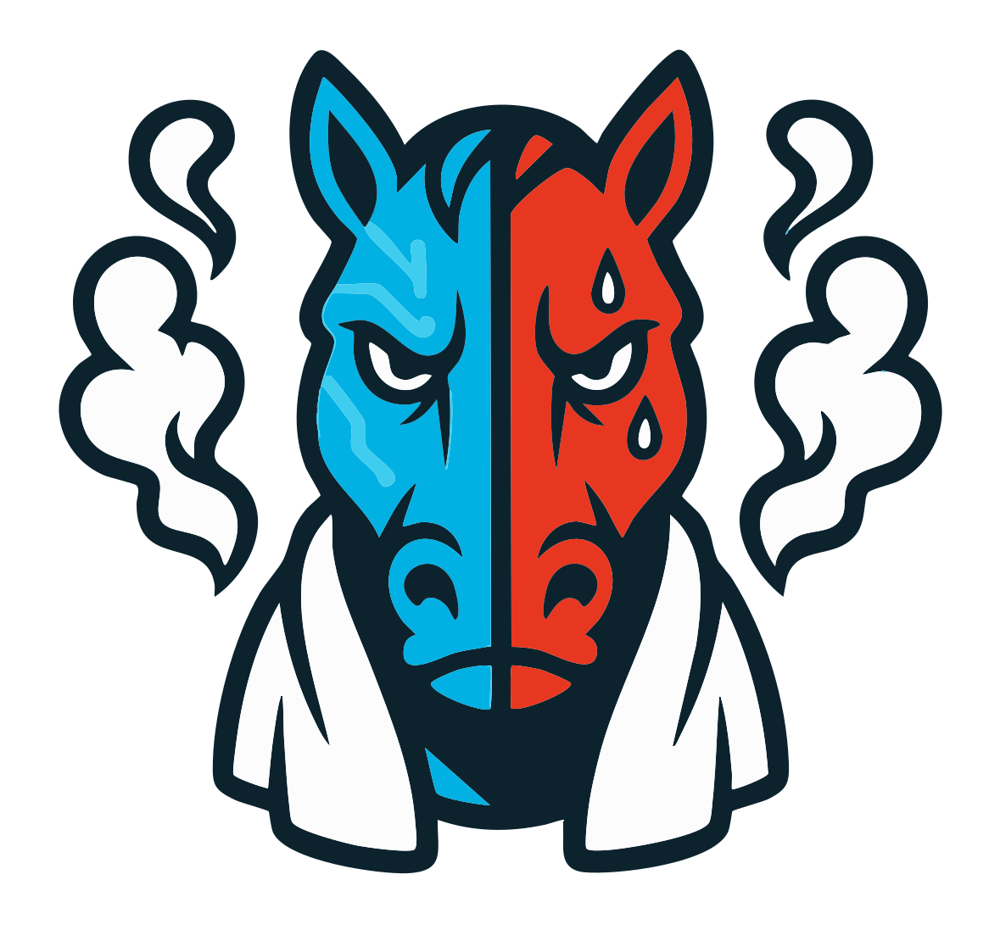
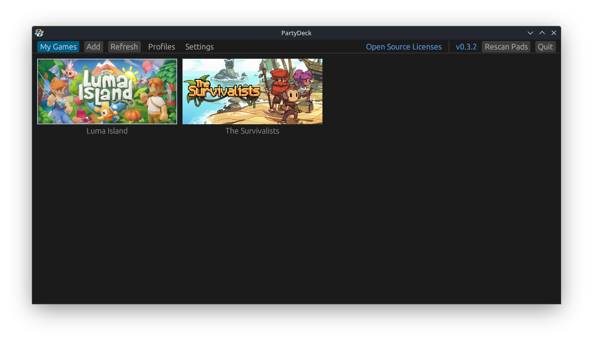
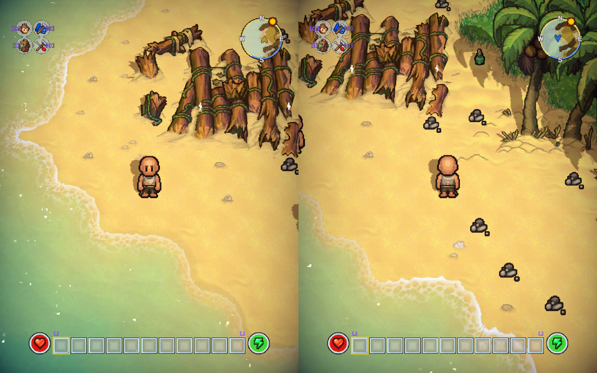
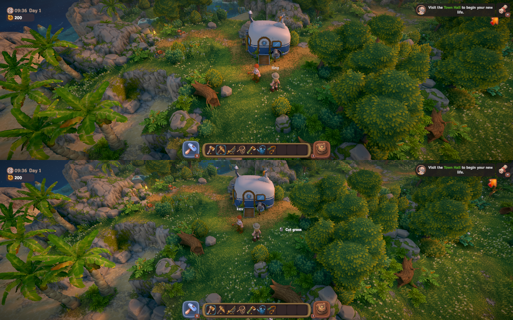

<table>
  <tr>
    <td width="260">
      
    </td>
    <td>
      <h1>SteamDeckHengst</h1>
      <em><strong>“Tames your games. Wrangles your inputs. Rides splitscreens like a pro.”</strong></em><br />
      SteamDeckHengst is the rowdy stablehand to your Valve stallion – launching up to <strong>four</strong> simultaneous game instances and splitting your screen like a Texas rodeo. <br />
      Based on <a href="https://github.com/wunnr/partydeck-rs">partydeck-rs</a> by <strong>wunnr</strong> – I just gave it spurs and attitude.
    </td>
  </tr>
</table>

---

## 🧪 TL;DR Features

- 🧩 Launch up to **4** simultaneous game instances  
- 🖥️ Auto-tiles games in split-screen (KWin + Gamescope)  
- 🎮 Full controller masking with per-instance isolation  
- 📂 Profiles for saves, settings, stats – one per player  
- 🕹️ Linux-native + Proton support  
- 🔗 LAN multiplayer via Goldberg Steam Emu  
- 🔀 Toggle 2-player layout: side-by-side or top-and-bottom  
- 🧼 No extra drivers needed – works out of the box on SteamOS  

---

<p align="center">
  
  
  
</p>

---

## 🚀 Quickstart

### SteamOS (3.7.0+)

1. Launch in Desktop Mode:
   ```bash
   partydeck-rs
   ```

2. Gaming Mode?  
   Add `PartyDeckKWinLaunch.sh` as a non-Steam game and disable Steam Input. That’s it.

### Desktop Linux

1. Install KDE Plasma, Gamescope, Bubblewrap:
   ```bash
   # pacman
   sudo pacman -S gamescope bubblewrap

   # or apt
   sudo apt install gamescope bubblewrap
   ```

2. Then:
   ```bash
   partydeck-rs
   ```

3. Disable Steam Input layouts for controllers.

---

## 🛠️ Setup & Build

```bash
./setup.sh       # installs rust + system dependencies
./build.sh       # builds the project (release by default)

# Debug mode (optional):
export BUILD_MODE=debug
./build.sh
```

Result: Everything ends up in `/build`.

---

## 📦 Game Handlers

You'll need these for game launching and sandboxing:  
👉 [Download from Proton Drive](https://drive.proton.me/urls/D9HBKM18YR#zG8XC8yVy9WL)

---

## 🧠 How It Works

| Layer | Description |
|-------|-------------|
| **KWin Session** | Custom session for window orchestration |
| **Gamescope** | Renders & resizes each game instance |
| **Bubblewrap** | Masks inputs + binds profile-specific data |
| **UMU Launcher** | Wraps Proton to launch Windows games |
| **Goldberg Steam Emu** | Emulates Steam multiplayer locally |
| **You** | Brave user, probably fighting 3 friends for one screen |

---

## 🧨 Known Issues

- 🛑 No Flatpak/AppImage support (yet)  
- 🧊 UI freezes during heavy loading – no spinner, no mercy  
- 👀 No multi-monitor support (would need deep KWin magic)  
- 🎮 Primitive controller UI navigation  
- 🔥 LAN discovery sometimes fails → open port `47584`  

---

## 🗺️ Roadmap

- [ ] Fully controller-navigable “Big Picture”-style UI -> in progress
- [ ] UI loading indicators / async progress feedback  -> in progress
- [ ] Multi-monitor + multi-keyboard/mouse support  
- [ ] Central handler repo & browser  
- [ ] In-app update mechanism  -> in progress

---

## 🤝 Credits

- 🛠️ [wunnr](https://github.com/wunnr) – partydeck-rs mastermind  
- 🧠 [MrGoldberg](https://github.com/Detanup01/gbe_fork) – Steam API wizardry  
- 🍷 [GloriousEggroll](https://github.com/Open-Wine-Components/umu-launcher) – Proton magic  
- 🧩 [Tau5](https://github.com/Tau5/Co-op-on-Linux) & [Syntrait](https://github.com/Syntrait/splinux)  
- 🧃 [SplitScreen.me](https://github.com/SplitScreen-Me/splitscreenme-nucleus) – Handler inspiration  

---

## 📜 License

TBD – choose wisely (MIT or GPL recommended).

---

## ⚠️ Disclaimer

This software was created for academic tinkering and curious hacking. Do not use it to break things. If you do, don't blame the stablehand.

---

## 💌 Contribute

Pull requests welcome.  
If you find a bug, feel free to submit an issue – or better yet, a fix.  
Bonus points if your commit messages are funny.
